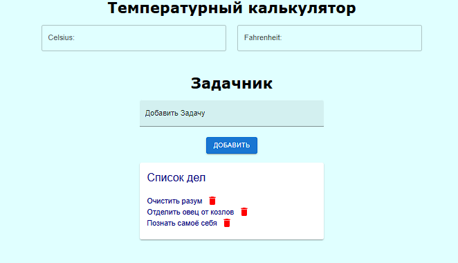

# Урок 3. Virtual DOM. Подключение библиотеки UI-компонентов #
## Задание 1: Температурный конвертер с Material UI ##

Цель: Создать компонент TemperatureConverter, используя компоненты TextField и Button из Material UI для ввода и отображения температур в градусах Цельсия и Фаренгейта.

Компоненты:
Используйте TextField для ввода значения температуры.
Добавьте лейблы к каждому TextField, указывая единицы измерения (Цельсия и Фаренгейта).

Логика:
При вводе значения в одно поле, автоматически конвертируйте его и отобразите в другом.
Реализуйте конвертацию температур в обоих направлениях.

## Задание 2: Список дел с Material UI ##

Цель: Разработать компонент TodoList для управления задачами: добавление, отображение, и удаление задач.

Компоненты:
Используйте TextField для ввода новой задачи.
Добавьте Button для добавления задачи в список.
Для каждой задачи в списке используйте Card или ListItem из Material UI. Внутри каждого элемента списка разместите текст задачи и IconButton с иконкой удаления (например, DeleteIcon).

Логика:
При нажатии на кнопку добавления, новая задача должна добавляться в список.
Рядом с каждой задачей должна быть кнопка для её удаления.

Устанавливаем МУИ: 
<code>npm install @mui/material @emotion/react @emotion/styled</code> 
<code>npm install @mui/icons-material</code>

Для перерасчёта температуры использовал события потери фокуса и нажатия "Enter"

Реализация [Temperature.js](src/components/Temperature.js).

Список задач реализован с помощью TextField, Button, Card и DeleteIcon.

Реализация [TodoList.js](src/components/TodoList.js).

